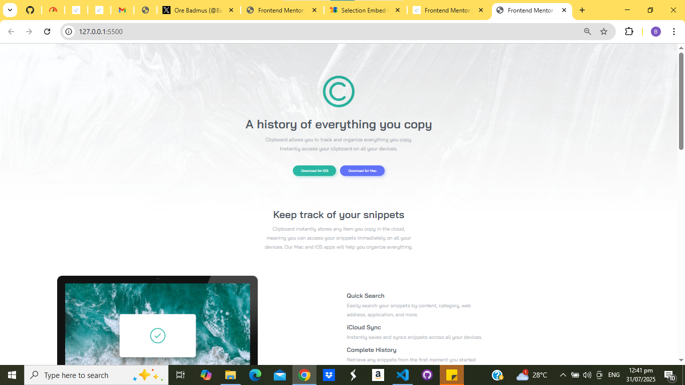
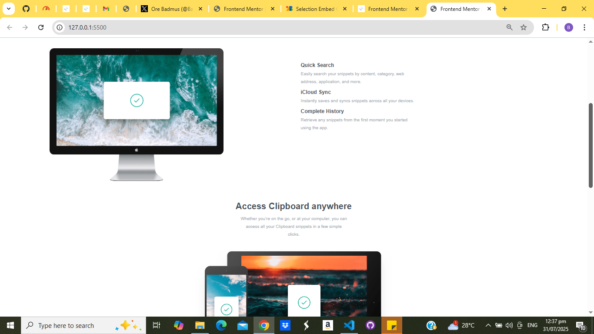
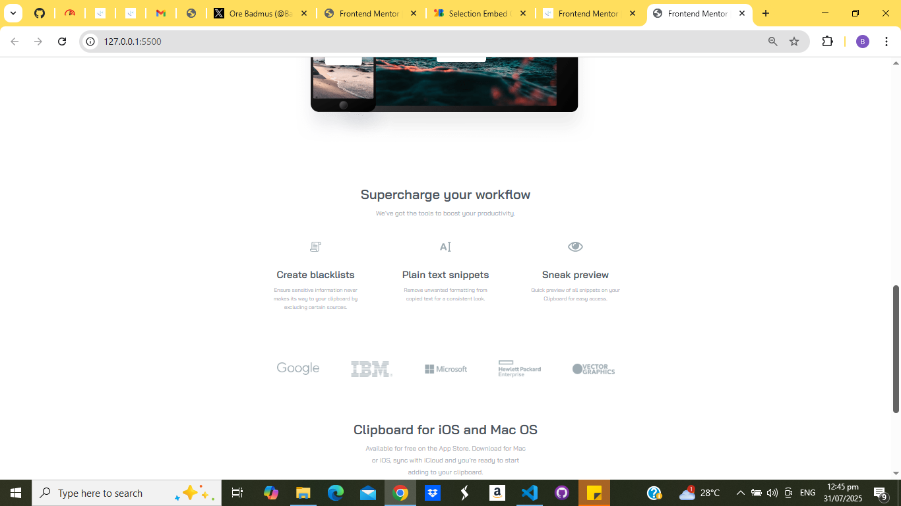
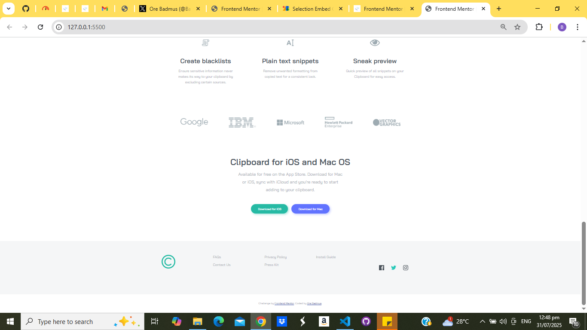

# Frontend Mentor - Clipboard landing page solution

This is a solution to the [Clipboard landing page challenge on Frontend Mentor](https://www.frontendmentor.io/challenges/clipboard-landing-page-5cc9bccd6c4c91111378ecb9). Frontend Mentor challenges help you improve your coding skills by building realistic projects.

## Table of contents

- [Overview](#overview)
  - [The challenge](#the-challenge)
  - [Screenshot](#screenshot)
  - [Links](#links)
- [My process](#my-process)
  - [Built with](#built-with)
  - [What I learned](#what-i-learned)
  - [Continued development](#continued-development)
- [Useful resources](#useful-resources)
- [Author](#author)
- [Acknowledgments](#acknowledgments)
--- 

## Overview

### The challenge

Users should be able to:

- View the optimal layout for the site depending on their device's screen size
- See hover states for all interactive elements on the page

### Screenshot

![Clipboard landing page screenshot] () () () () 

### Links

- **Solution URL**: (https://github.com/OreBadmus/clipboard-landing-page-master.git)
- **Live Site URL**: (http://127.0.0.1:5500/)


## My process

### Built with 

 🛠 Technologies Used

- **HTML5** – Semantic structure with accessibility in mind
- **CSS3** – Modern styles with flexbox, grid, and responsive design
- **Google Fonts** – Bai Jamjuree typeface
- **Media Queries** – Adaptive layout for mobile, tablet, and desktop
- **Mobile-first** workflow
-  **Responsive design** - Mobile & Desktop

 ✨ Features

 ## ✅ HTML Highlights

- `picture` element used for responsive background images
- Clear sectioning for each major part of the page (`showcase`, `features`, `workflow`, etc.)
- Clean use of `ul` lists and semantic tags (`section`, `article`, `footer`)

 ## 🎨 CSS Highlights

- Custom **buttons** with shadows, color schemes (green & blue), and hover effects
- Responsive **grid and flex layouts**
- Adaptive spacing and typography using media queries:
  - `768px`: Tablet layout adjustments
  - `1024px`: Desktop enhancements (grid layout, larger fonts, positioned images)
- Mobile-first design: Starts simple, scales up for larger screens
- Hover effect for footer social icons using color filters

 ## 📱 Responsive Design

- **Mobile (default)**:
  - Vertical stacking of buttons, logos, and features
- **Tablet and Desktop**:
  - Multi-column grid layouts
  - Centered and aligned content
  - Positioned computer image for visual enhancement


### What I learned

This project improved my confidence in responsive design using only CSS Grid and Flexbox. I learned how to:

- Use the `<picture>` element to serve responsive images
- Apply hover effects with subtle transitions for better UI feedback
- Create a fully responsive layout using media queries at 768px and 1024px breakpoints

Example snippet I'm proud of:

```css
footer ul.social-media {
  display: flex;
  align-items: center;
  justify-content: center;
  gap: 2rem;
  margin-top: 3rem;
  cursor: pointer;
}

This snippet allowed me to create a clean and responsive social media footer.

### Continued development

In future projects, I want to:

Practice using CSS clamp() and fluid typography

Try integrating a JavaScript clipboard feature to make it interactive

Explore using SASS for better organization and reuse


### Useful resources

MDN Web Docs – CSS Grid – helped me structure responsive sections cleanly.

Frontend Mentor Slack Community – great place to see how others tackled similar layouts.


## Author

- Website – Ore Badmus (https://github.com/OreBadmus)
- Frontend Mentor – @OreBadmus (https://www.frontendmentor.io/profile/OreBadmus)
- Twitter - @Badmus065012 (https://x.com/BadmusO65012?t=FW1S_kTqW2OdKzrdG6VZiQ&s=09)


## Acknowledgments

Big thanks to Frontend Mentor for the challenge design and inspiration. This project was completed solo, but inspired by the great community solutions on the platform.

